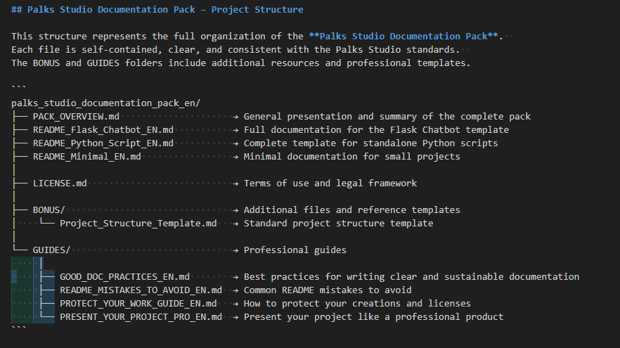

<p align="center">
  
</p>


[](https://palks-studio.com/fr/framework-documentation)

<p align="center">
  <a href="https://palks-studio.com">
    
  </a>
</p>

# Palks Studio – Documentation Framework (FR / EN)

> Ce dépôt constitue une présentation technique et une documentation du projet.  
> Il ne contient pas de code source téléchargeable ni de fichiers de production.

_A complete professional documentation pack designed for developers and creators._  
_Structure, clarity, and protection for your projects — ready to use._

---

## 🇫🇷 Version française

### Présentation

Le **Documentation Framework** de **Palks Studio** est un ensemble complet de modèles, fichiers et guides conçus pour créer,  structurer et protéger la documentation de tes projets professionnels.  
Chaque élément suit la charte visuelle et la philosophie du studio : **simplicité, clarté, efficacité**.

[](https://palks-studio.com/fr/framework-documentation)

---

## Contenu du pack

**Modèles de documentation**  
- `README_Flask_Chatbot_FR.md` : modèle complet pour application Flask  
- `README_Python_Script_FR.md` : modèle pour script Python autonome  
- `README_Minimal_FR.md` : modèle léger pour petits projets

**Fichiers structurels et licences**  
- `PACK_OVERVIEW.md` : présentation du pack complet  
- `LICENCE.md` : licence propriétaire officielle  
- `Arborescence_Projet_Type.md` : exemple d’arborescence normalisée

**Guides professionnels**  
- `GOOD_DOC_PRACTICES_FR.md` : bonnes pratiques de rédaction  
- `README_MISTAKES_TO_AVOID_FR.md` : erreurs courantes à éviter  
- `PROTECT_YOUR_WORK_GUIDE_FR.md` : protéger et encadrer ses créations  
- `PRESENT_YOUR_PROJECT_PRO_FR.md` : présenter un projet comme un professionnel

---

## Structure du projet

```
palks_studio_documentation_pack_fr/
├── PACK_OVERVIEW.md                     → Présentation générale et sommaire du pack complet
├── README_Flask_Chatbot_FR.md           → Documentation complète du template Flask Chatbot
├── README_Python_Script_FR.md           → Modèle complet pour scripts Python autonomes
├── README_Minimal_FR.md                 → Documentation minimale pour petits projets
│
├── LICENCE.md                           → Conditions d’utilisation et cadre légal
│
├── BONUS/                               → Fichiers complémentaires et modèles annexes
│    └──  Arborescence_Projet_Type.md     → Exemple d’arborescence de projet
│
└── GUIDES/                              → Guides professionnels
     ├── GOOD_DOC_PRACTICES_FR.md        → Bonnes pratiques pour rédiger une documentation claire et durable
     ├── README_MISTAKES_TO_AVOID_FR.md  → Erreurs courantes à éviter dans un README
     ├── PROTECT_YOUR_WORK_GUIDE_FR.md   → Conseils pour protéger ses créations et licences
     └── PRESENT_YOUR_PROJECT_PRO_FR.md  → Présenter un projet comme un produit professionnel
```


---

## Pourquoi ce framework est unique

- Réunit **structure, lisibilité et professionnalisme**  
- Compatible avec GitHub, Gumroad, Itch.io, Ko-fi  
- Idéal pour développeurs, studios et freelances exigeants  
- Clé en main : aucun outil externe requis

---

## 🇬🇧 English Version

> This repository is a technical presentation and documentation repository.  
> It does not contain downloadable source code or production files.
>
> [](https://palks-studio.com/en/documentation-framework])

### Overview

The **Palks Studio Documentation Framework** is a complete collection of templates, guides, and license files to help you structure,  present, and protect your projects like a professional.  
Each document follows the studio’s philosophy: **simplicity, clarity, efficiency.**

---

## Pack Contents

**Documentation Templates**  
- `README_Flask_Chatbot_EN.md`: full template for Flask projects  
- `README_Python_Script_EN.md`: standalone Python script template  
- `README_Minimal_EN.md`: lightweight README model

**Structure Files & Licenses**  
- `PACK_OVERVIEW.md`: full pack overview and structure  
- `LICENSE.md`: proprietary Palks Studio license  
- `Project_Structure_Template.md`: standardized project example

**Professional Guides**
- `GOOD_DOC_PRACTICES_EN.md`: best documentation practices  
- `README_MISTAKES_TO_AVOID_EN.md`: common mistakes to avoid  
- `PROTECT_YOUR_WORK_GUIDE_EN.md`: protecting and licensing your work  
- `PRESENT_YOUR_PROJECT_PRO_EN.md`: presenting your project professionally

---

## Project structure

```
palks_studio_documentation_pack_en/
├── PACK_OVERVIEW.md                     → General presentation and summary of the complete pack
├── README_Flask_Chatbot_EN.md           → Full documentation for the Flask Chatbot template
├── README_Python_Script_EN.md           → Complete template for standalone Python scripts
├── README_Minimal_EN.md                 → Minimal documentation for small projects
│
├── LICENSE.md                           → Terms of use and legal framework
│
├── BONUS/                               → Additional files and reference templates
│    └── Project_Structure_Template.md   → Standard project structure template
│
└── GUIDES/                              → Professional guides
     ├── GOOD_DOC_PRACTICES_EN.md        → Best practices for writing clear and sustainable documentation
     ├── README_MISTAKES_TO_AVOID_EN.md  → Common README mistakes to avoid
     ├── PROTECT_YOUR_WORK_GUIDE_EN.md   → How to protect your creations and licenses
     └── PRESENT_YOUR_PROJECT_PRO_EN.md  → Present your project like a professional product 
```


---

## Why This Framework Stands Out

- Combines **clarity, professionalism, and structure**  
- Compatible with GitHub, Gumroad, Itch.io, and Ko-fi  
- Perfect for developers, studios, and freelancers  
- No external dependencies required

---

© Palks Studio — see LICENSE.md  
- https://palks-studio.com
